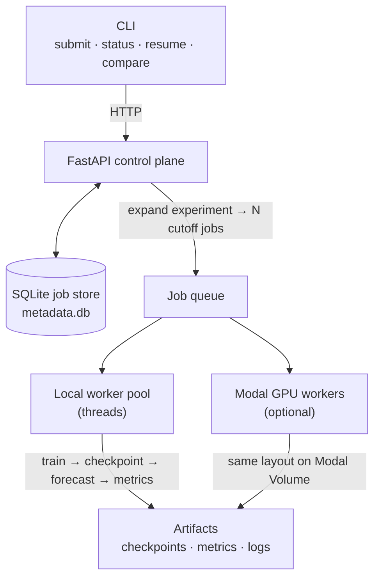

# TrainExtend

[](https://github.com/srikara-V/trainextend/actions/workflows/trainextend-ci.yml)
[](https://www.python.org/downloads/)
[](LICENSE)
[](https://github.com/astral-sh/ruff)

A resumable experiment runner for rolling-window time-series forecasting backtests.

TrainExtend is an **experiment control plane**. You describe a backtest in YAML; it expands that into one
training job per cutoff, runs a PyTorch MLP forecaster on each job, checkpoints progress, evaluates holdout
forecasts, and aggregates horizon metrics across cutoffs. Kill a worker mid-run — or let one crash — and
`resume` picks the job back up from the last good checkpoint.

## Why

Rolling-window backtests are embarrassingly parallel but operationally annoying: one config fans out into
many training runs, any of which can die halfway through, and the results only mean something once every
cutoff has finished. Most teams solve this with a pile of shell scripts. TrainExtend packages the missing
infrastructure — job expansion, queuing, checkpoint/resume, and metric aggregation — into one small,
inspectable codebase that runs the same workflow on a laptop thread pool or on Modal GPUs.

## What it does

1. **Accepts an experiment config** with dataset, model, backtest cutoffs, metrics, and runtime settings.
2. **Expands the experiment into jobs** — one job per backtest cutoff.
3. **Trains an MLP forecaster** on sliding windows of history up to each cutoff.
4. **Checkpoints training** at a fixed step interval using atomic writes (`step_XXXXXX.pt`, `latest.json`, `last_good.json`).
5. **Evaluates a holdout forecast** after training and writes `predictions.csv` and `metrics.json` per job.
6. **Resumes failed or interrupted jobs** from the last good checkpoint, restoring model and optimizer state.
7. **Aggregates results** across cutoffs with `compare` (mean MSE / MAE / sMAPE).

Datasets: built-in synthetic series, or a CSV path with `target` and `time_col` columns.

Workers: a local background thread pool, or Modal GPU workers (T4 by default) with a shared Modal Volume.

## Architecture



Every job follows the same state machine: `queued → running → checkpointing ⇄ running → completed`, with
`failed → resuming → running` on crash recovery. All transitions are persisted in SQLite and appended to a
per-job `events.jsonl` audit log.

## Design decisions

- **Crash-safe checkpoints via atomic pointer swap.** Checkpoint tensors are written to a temp file and
  atomically renamed into place; `latest.json` and `last_good.json` are small pointer files written with
  temp-file + fsync + rename. A crash mid-write can never corrupt the checkpoint a resume depends on —
  `last_good.json` only ever points at a checkpoint that loaded successfully.
- **SQLite as the job store.** The control plane needs durable job state, a FIFO queue, and an event log —
  not a distributed database. SQLite gives all three with zero deployment overhead, and the store is a single
  class (`JobStore`) that could be swapped for Postgres behind the same interface.
- **One job per cutoff.** Backtest cutoffs are independent by construction, so the experiment expander turns
  each into an isolated job with its own checkpoints and artifacts. Failures are contained: an experiment
  with one dead cutoff is `partial`, not lost, and only the failed job re-runs.
- **Same artifact layout everywhere.** Local workers write to `./trainextend_data`; Modal workers write the
  identical tree to a shared Modal Volume. Status, resume, and compare don't care where training ran.
- **Failure injection is a first-class feature.** Configs can crash a worker at a chosen step
  (`simulate_failure_at_step`), and `simulate-failure` crashes a live job on its next step. Recovery paths
  are exercised in the test suite, not just claimed.

## Install

Requires Python 3.11+.

```bash
python3.11 -m venv .venv
source .venv/bin/activate
pip install -e ".[dev]"
```

For Modal GPU workers:

```bash
pip install -e ".[modal]"
modal setup
```

## Quick start (local CPU)

Terminal 1 — start the control plane:

```bash
trainextend serve --backend local
```

Terminal 2 — submit a 3-cutoff rolling backtest on synthetic data:

```bash
trainextend submit --config configs/synthetic_backtest.yaml
trainextend exp-status <experiment_id>
trainextend compare <experiment_id>
```

Example `compare` output (metrics averaged across cutoffs):

```text
Experiment: synthetic_mlp_demo (exp_xxxxxxxxxx)

Model      Dataset      Horizon  Cutoffs  MSE        MAE        sMAPE
MLP        synthetic    24       3        0.042      0.158      8.2
```

## Experiment config

```yaml
experiment_name: synthetic_mlp_demo

dataset:
  name: synthetic          # built-in series; or any name with dataset.path set
  path: null               # required for CSV datasets
  target: value            # CSV column to forecast
  time_col: date           # CSV timestamp column (used for cutoff resolution)

model:
  name: MLP
  context_length: 96       # history window length
  prediction_length: 24    # forecast horizon

backtest:
  cutoffs:
    - "4000"               # index into series, or timestamp for CSV data
    - "4200"
    - "4400"

metrics: [mse, mae, smape]

runtime:
  gpu: cpu                 # cpu, T4, etc.
  use_gpu: false
  max_steps: 200
  max_epochs: 20
  batch_size: 32
  learning_rate: 0.001
  checkpoint_every_steps: 50
  resume: true
  simulate_failure_at_step: null   # optional: crash at this step for demos
```

Each cutoff becomes its own job. Checkpoints store forecast metadata (`cutoff`, `horizon`, `context_length`, `experiment_id`).

## Failure recovery

Config-driven crash (see `configs/failure_forecast_demo.yaml`):

```bash
trainextend submit --config configs/failure_forecast_demo.yaml
trainextend status <job_id>    # failed at step 250; last good checkpoint at 200
trainextend resume <job_id>
trainextend compare <experiment_id>
```

Or trigger a crash on a running job:

```bash
trainextend simulate-failure <job_id>
trainextend resume <job_id>
```

Resume loads from `last_good.json` (falls back to `latest.json`), restores model and optimizer state, and
continues training from that step.

## Modal GPU

```bash
trainextend modal deploy

trainextend serve --backend modal
trainextend submit --config configs/synthetic_backtest_gpu.yaml
```

Modal workers read and write the same artifact layout under `/vol/trainextend` on the `trainextend-vol` volume.

## CLI

| Command | Description |
|---------|-------------|
| `trainextend serve` | Start the FastAPI control plane |
| `trainextend submit -c <config.yaml>` | Submit an experiment or legacy single job |
| `trainextend exp-status <exp_id>` | Experiment status and child job IDs |
| `trainextend compare <exp_id>` | Aggregate metrics across completed cutoffs |
| `trainextend status <job_id>` | Job status, step, checkpoints, error |
| `trainextend resume <job_id>` | Re-queue a failed job from last good checkpoint |
| `trainextend checkpoints <job_id>` | List saved checkpoints |
| `trainextend logs <job_id>` | Job event log |
| `trainextend cancel <job_id>` | Cancel a job |
| `trainextend simulate-failure <job_id>` | Crash a running job on the next step |
| `trainextend modal deploy` | Deploy Modal GPU workers |

Environment variables:

- `TRAINEXTEND_API_URL` — CLI target (default `http://127.0.0.1:8000`)
- `TRAINEXTEND_DATA_DIR` — artifact root (default `./trainextend_data`)
- `TRAINEXTEND_BACKEND` — `local` or `modal`

## Artifacts

```text
trainextend_data/
  metadata.db
  experiments/<exp_id>/config.yaml
  jobs/<job_id>/
    config.yaml
    checkpoints/
      step_000050.pt
      latest.json
      last_good.json
    artifacts/
      metrics.json       # MSE, MAE, sMAPE + job metadata
      predictions.csv    # actual vs forecast per horizon step
    logs/
      events.jsonl
```

## Development

```bash
pip install -e ".[dev]"
pytest -q                          # run the test suite
ruff check trainextend tests       # lint
ruff format trainextend tests      # format
```

The test suite covers the failure paths, not just the happy path: checkpoint round-trips, resume-from-crash
state restoration, job state transitions, experiment expansion, and a full end-to-end backtest against the
live FastAPI app.

## Legacy demo jobs

Configs without `experiment_name` / `backtest` submit a single MNIST or synthetic CNN training job
(`configs/demo_cpu.yaml`). Useful for testing checkpoint/resume mechanics without forecasting.

## Inspiration

This was done as an effort to create a generalizable lightweight training infra, where I originally used a
similar approach for evaluating [HNMD-based loss functions for time-series forecasting models](https://github.com/srikara-V/Hierarchical-NURBS-Inspired-Multi-Domain-Loss-for-Training-Deep-Time-Series-Forecasting-Models)
and running evals for the Yale Graph and Geometric Learning Lab.

## License

[MIT](LICENSE)
